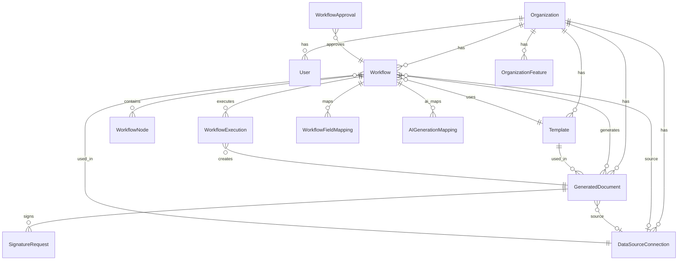
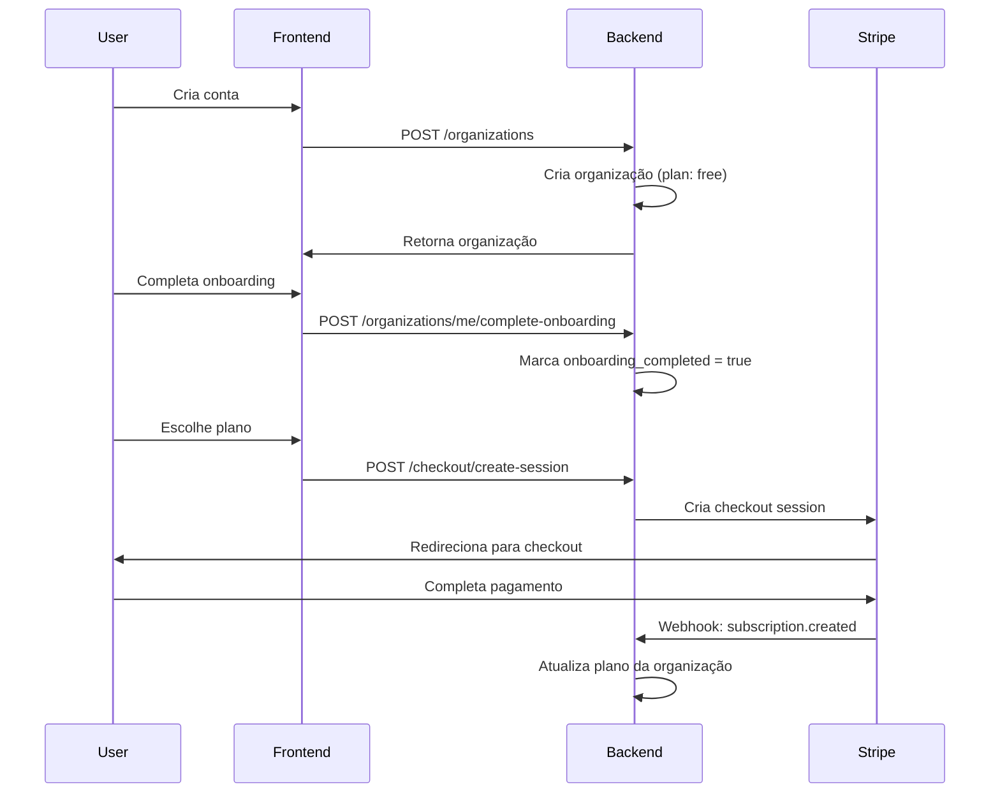
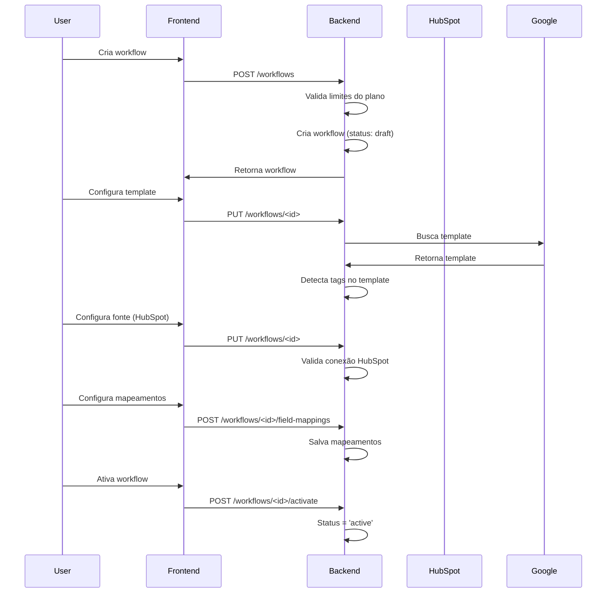
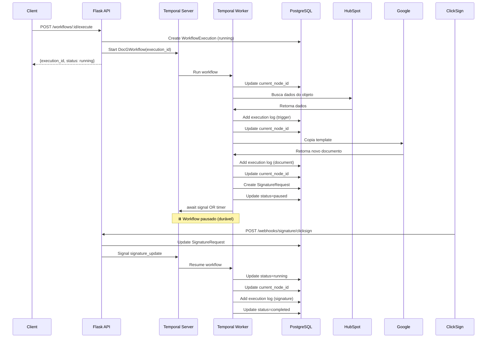
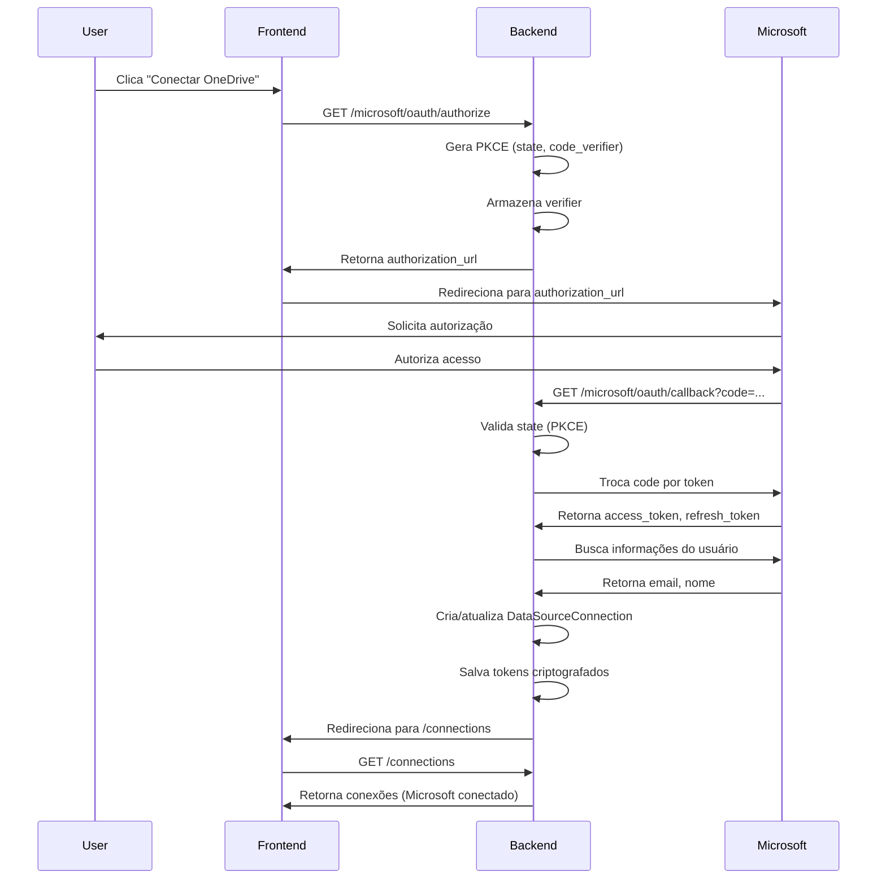
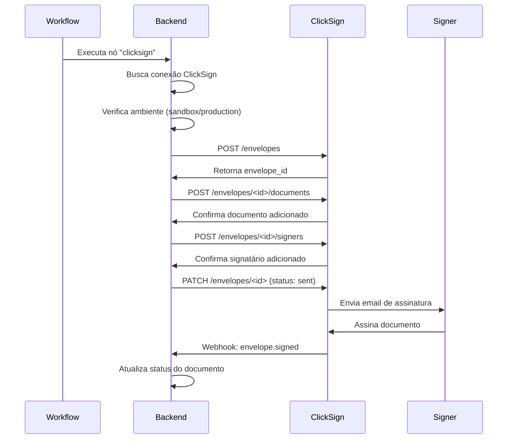

# Arquitetura e Documentação do Backend - DocGen

## Visão Geral

O DocGen Backend é uma aplicação Flask que fornece uma API RESTful para geração automatizada de documentos, integração com múltiplas fontes de dados (HubSpot, Google Drive, Microsoft OneDrive), assinatura digital (ClickSign) e gerenciamento de workflows.

### Tecnologias Principais

- **Framework**: Flask (Python)
- **ORM**: SQLAlchemy
- **Banco de Dados**: PostgreSQL
- **Migrações**: Flask-Migrate (Alembic)
- **Autenticação**: JWT + OAuth (Google, Microsoft, HubSpot)
- **Pagamentos**: Stripe
- **Criptografia**: AES-256 para credenciais sensíveis
- **Execução Assíncrona**: Temporal.io (execução durável de workflows)

## Estrutura de Diretórios

```
docg-backend/
├── app/
│   ├── __init__.py          # Inicialização da aplicação Flask
│   ├── config.py            # Configurações da aplicação
│   ├── database.py          # Configuração do banco de dados
│   ├── auth.py              # Utilitários de autenticação
│   ├── models/              # Modelos de dados (SQLAlchemy)
│   │   ├── organization.py
│   │   ├── workflow.py
│   │   ├── document.py
│   │   ├── template.py
│   │   ├── connection.py
│   │   ├── execution.py
│   │   ├── approval.py
│   │   └── ...
│   ├── routes/              # Blueprints de rotas da API
│   │   ├── workflows.py
│   │   ├── organizations.py
│   │   ├── connections.py
│   │   ├── documents.py
│   │   ├── templates.py
│   │   ├── checkout.py
│   │   ├── billing.py
│   │   ├── webhooks.py
│   │   ├── microsoft_oauth_routes.py
│   │   ├── hubspot_oauth_routes.py
│   │   └── ...
│   ├── services/            # Lógica de negócio
│   │   ├── workflow_executor.py
│   │   ├── envelope_creation_service.py
│   │   ├── stripe_service.py
│   │   ├── ai/
│   │   ├── document_generation/
│   │   ├── data_sources/
│   │   └── integrations/
│   ├── temporal/          # Integração Temporal (execução assíncrona)
│   │   ├── __init__.py
│   │   ├── config.py
│   │   ├── client.py
│   │   ├── service.py
│   │   ├── worker.py
│   │   ├── workflows/
│   │   │   └── docg_workflow.py
│   │   └── activities/
│   │       ├── base.py
│   │       ├── trigger.py
│   │       ├── document.py
│   │       ├── approval.py
│   │       ├── signature.py
│   │       └── email.py
│   └── utils/               # Utilitários
│       ├── encryption.py
│       ├── auth.py
│       └── ...
├── migrations/              # Migrações do banco de dados
├── scripts/                # Scripts utilitários
│   └── verify_temporal.py
└── requirements.txt         # Dependências Python
```

## Modelo de Dados

### Diagrama ER



### Modelos Principais

#### Organization

Entidade central que representa uma organização/cliente.

**Campos Principais:**
- `id` (UUID): Identificador único
- `name` (String): Nome da organização
- `slug` (String): Identificador URL-friendly único
- `plan` (String): Plano atual (free, starter, pro, team, enterprise)
- `documents_limit` (Integer): Limite mensal de documentos
- `documents_used` (Integer): Documentos gerados no período
- `users_limit` (Integer): Limite de usuários
- `workflows_limit` (Integer): Limite de workflows (None = ilimitado)
- `workflows_used` (Integer): Workflows criados
- `stripe_customer_id` (String): ID do cliente no Stripe
- `stripe_subscription_id` (String): ID da assinatura no Stripe
- `trial_expires_at` (DateTime): Data de expiração do trial
- `onboarding_completed` (Boolean): Se o onboarding foi concluído
- `onboarding_data` (JSONB): Dados do onboarding

**Métodos Importantes:**
- `can_generate_document()`: Verifica se há quota disponível
- `can_create_workflow()`: Verifica se pode criar novo workflow
- `get_usage()`: Retorna uso atual (users, documents, workflows)
- `sync_workflows_count()`: Sincroniza contador com banco de dados

#### Workflow

Representa um fluxo de trabalho automatizado para geração de documentos.

**Campos Principais:**
- `id` (UUID): Identificador único
- `organization_id` (UUID): Organização proprietária
- `name` (String): Nome do workflow
- `status` (String): draft, active, paused, archived
- `source_connection_id` (UUID): Conexão de dados fonte
- `source_object_type` (String): Tipo de objeto fonte (ex: "deal", "contact")
- `source_config` (JSONB): Configuração da fonte
- `template_id` (UUID): Template usado
- `output_folder_id` (String): ID da pasta de destino
- `output_name_template` (String): Template do nome do arquivo
- `trigger_type` (String): manual, webhook, scheduled
- `trigger_config` (JSONB): Configuração do trigger
- `post_actions` (JSONB): Ações pós-geração (ex: assinatura, anexo no HubSpot)

**Relacionamentos:**
- `field_mappings`: Mapeamentos de campos do template
- `ai_mappings`: Mapeamentos de geração por IA
- `nodes`: Nós do workflow (estrutura de pipeline)
- `executions`: Execuções do workflow

#### DataSourceConnection

Representa uma conexão com uma fonte de dados externa.

**Campos Principais:**
- `id` (UUID): Identificador único
- `organization_id` (UUID): Organização proprietária
- `source_type` (String): Tipo de fonte (hubspot, microsoft, clicksign, openai, anthropic, etc.)
- `name` (String): Nome da conexão
- `credentials` (JSONB): Credenciais criptografadas
- `config` (JSONB): Configuração adicional (ex: portal_id, environment)
- `status` (String): active, expired, error

**Tipos de Conexão Suportados:**
- **CRM**: hubspot
- **Armazenamento**: google_drive, microsoft (OneDrive)
- **Assinatura**: clicksign, docusign, d4sign, etc.
- **IA**: openai, anthropic, gemini

#### Template

Representa um template de documento (Google Docs, Google Slides, Word, PowerPoint).

**Campos Principais:**
- `id` (UUID): Identificador único
- `organization_id` (UUID): Organização proprietária
- `name` (String): Nome do template
- `google_file_id` (String): ID do arquivo no Google Drive
- `google_file_type` (String): document, presentation
- `microsoft_file_id` (String): ID do arquivo no OneDrive/SharePoint
- `microsoft_file_type` (String): word, powerpoint
- `detected_tags` (JSONB): Tags detectadas no template (ex: {{contact.firstname}})

#### GeneratedDocument

Representa um documento gerado a partir de um workflow.

**Campos Principais:**
- `id` (UUID): Identificador único
- `workflow_id` (UUID): Workflow que gerou o documento
- `template_id` (UUID): Template usado
- `source_object_id` (String): ID do objeto fonte (ex: deal ID no HubSpot)
- `name` (String): Nome do documento
- `google_doc_id` (String): ID do documento no Google Drive
- `google_doc_url` (String): URL do documento
- `pdf_file_id` (String): ID do PDF gerado
- `pdf_url` (String): URL do PDF
- `hubspot_file_id` (String): ID do arquivo anexado no HubSpot
- `status` (String): generating, generated, error, sent_for_signature, signed

#### WorkflowExecution

Representa uma execução de um workflow.

**Campos Principais:**
- `id` (UUID): Identificador único
- `workflow_id` (UUID): Workflow executado
- `generated_document_id` (UUID): Documento gerado
- `trigger_type` (String): Tipo de trigger
- `trigger_data` (JSONB): Dados do trigger
- `status` (String): running, completed, failed, paused
- `ai_metrics` (JSONB): Métricas de geração por IA (tokens, custo, tempo)
- `temporal_workflow_id` (String): ID do workflow no Temporal Server
- `temporal_run_id` (String): Run ID do Temporal (para debug)
- `current_node_id` (UUID): Node atual sendo executado
- `execution_context` (JSONB): Snapshot do contexto de execução
- `execution_logs` (JSONB): Logs por node executado

## Endpoints da API

### Base URL
```
/api/v1
```

### Autenticação

Todos os endpoints (exceto OAuth callbacks) requerem autenticação via Bearer Token no header:
```
Authorization: Bearer <token>
```

### Organizações

#### `POST /api/v1/organizations`
Cria uma nova organização.

**Body:**
```json
{
  "name": "Nome da Organização",
  "plan": "free"
}
```

#### `GET /api/v1/organizations/me`
Retorna a organização do usuário autenticado.

#### `PUT /api/v1/organizations/me`
Atualiza a organização do usuário.

#### `POST /api/v1/organizations/me/complete-onboarding`
Marca o onboarding como concluído.

### Workflows

#### `GET /api/v1/workflows`
Lista workflows da organização.

**Query Params:**
- `status`: Filtrar por status (draft, active, paused, archived)

#### `POST /api/v1/workflows`
Cria um novo workflow.

**Body:**
```json
{
  "name": "Workflow Name",
  "description": "Description",
  "source_connection_id": "uuid",
  "source_object_type": "deal",
  "template_id": "uuid",
  "output_folder_id": "folder-id",
  "trigger_type": "manual"
}
```

#### `GET /api/v1/workflows/<workflow_id>`
Retorna detalhes de um workflow.

#### `PUT /api/v1/workflows/<workflow_id>`
Atualiza um workflow.

#### `DELETE /api/v1/workflows/<workflow_id>`
Deleta um workflow.

#### `POST /api/v1/workflows/<workflow_id>/activate`
Ativa um workflow (muda status para 'active').

#### `GET /api/v1/workflows/<workflow_id>/nodes`
Lista nós de um workflow.

#### `POST /api/v1/workflows/<workflow_id>/nodes`
Cria um novo nó no workflow.

**Body:**
```json
{
  "type": "google-docs",
  "config": {},
  "order": 1
}
```

**Tipos de Nós:**
- `trigger`: Nó inicial (webhook, manual)
- `google-docs`: Geração de Google Docs
- `google-slides`: Geração de Google Slides
- `microsoft-word`: Geração de Word
- `microsoft-powerpoint`: Geração de PowerPoint
- `clicksign`: Envio para assinatura
- `webhook`: Webhook externo
- `human-in-loop`: Aprovação humana

#### `GET /api/v1/workflows/<workflow_id>/field-mappings`
Lista mapeamentos de campos do workflow.

#### `GET /api/v1/workflows/<workflow_id>/ai-mappings`
Lista mapeamentos de IA do workflow.

#### `POST /api/v1/workflows/<workflow_id>/ai-mappings`
Cria mapeamento de IA.

**Body:**
```json
{
  "tag": "{{paragrapho1}}",
  "provider": "openai",
  "model": "gpt-4",
  "prompt": "Generate content...",
  "config": {}
}
```

#### `GET /api/v1/workflows/<workflow_id>/preview`
Gera preview do workflow com dados de exemplo.

### Conexões

#### `GET /api/v1/connections`
Lista conexões da organização.

**Query Params:**
- `source_type`: Filtrar por tipo (hubspot, clicksign, openai, etc.)

#### `POST /api/v1/connections`
Cria uma nova conexão.

**Body:**
```json
{
  "source_type": "clicksign",
  "name": "ClickSign Production",
  "credentials": {
    "api_key": "sk-..."
  },
  "config": {
    "environment": "production"
  }
}
```

#### `PUT /api/v1/connections/<connection_id>`
Atualiza uma conexão.

#### `DELETE /api/v1/connections/<connection_id>`
Deleta uma conexão.

### Conexões de IA

#### `GET /api/v1/ai/connections`
Lista conexões de IA.

#### `POST /api/v1/ai/connections`
Cria conexão de IA.

**Body:**
```json
{
  "provider": "openai",
  "api_key": "sk-...",
  "name": "OpenAI Connection"
}
```

#### `PUT /api/v1/ai/connections/<connection_id>`
Atualiza conexão de IA.

#### `DELETE /api/v1/ai/connections/<connection_id>`
Deleta conexão de IA.

#### `POST /api/v1/ai/connections/<connection_id>/test`
Testa uma conexão de IA.

### Provedores de Assinatura

#### `GET /api/v1/signature-providers`
Lista provedores de assinatura disponíveis.

#### `GET /api/v1/signature-providers/<provider_id>`
Retorna detalhes de um provedor.

#### `POST /api/v1/signature-providers/<provider_id>/test`
Testa uma API key de assinatura.

**Body:**
```json
{
  "api_key": "sk-...",
  "environment": "sandbox"  // Apenas para ClickSign
}
```

### OAuth - Microsoft

#### `GET /api/v1/microsoft/oauth/authorize`
Inicia fluxo OAuth do Microsoft.

**Query Params:**
- `frontend_redirect_uri`: URI para redirecionar após autenticação
- `organization_id`: ID da organização (opcional)

**Response:**
```json
{
  "success": true,
  "authorization_url": "https://login.microsoftonline.com/...",
  "state": "random-state"
}
```

#### `GET /api/v1/microsoft/oauth/callback`
Callback do OAuth do Microsoft (chamado pelo Microsoft).

#### `GET /api/v1/microsoft/oauth/status`
Retorna status da conexão Microsoft.

### OAuth - HubSpot

#### `GET /api/v1/hubspot-oauth/authorize`
Inicia fluxo OAuth do HubSpot.

**Response:**
```json
{
  "authUrl": "https://app.hubspot.com/..."
}
```

### Checkout (Stripe)

#### `POST /api/v1/checkout/create-session`
Cria sessão de checkout do Stripe.

**Body:**
```json
{
  "price_id": "price_...",
  "success_url": "https://...",
  "cancel_url": "https://..."
}
```

**Response:**
```json
{
  "session_id": "cs_...",
  "url": "https://checkout.stripe.com/..."
}
```

### Billing

#### `GET /api/v1/billing/subscription`
Retorna informações da assinatura atual.

#### `POST /api/v1/billing/create-portal-session`
Cria sessão do Stripe Customer Portal.

### Webhooks

#### `POST /api/v1/webhooks/<workflow_id>/<webhook_token>`
Endpoint de webhook para trigger de workflow.

**Body:** Dados do webhook (formato livre)

#### `POST /api/v1/webhooks/test/<workflow_id>`
Testa um webhook manualmente.

#### `GET /api/v1/webhooks/logs/<workflow_id>`
Lista logs de webhooks.

#### `POST /api/v1/webhooks/regenerate-token/<workflow_id>`
Regenera token do webhook.

#### `POST /api/v1/webhooks/stripe`
Webhook do Stripe para eventos de assinatura.

### Aprovações

#### `GET /api/v1/approvals/<approval_token>`
Retorna detalhes de uma aprovação pendente.

#### `POST /api/v1/approvals/<approval_token>/approve`
Aprova uma solicitação.

#### `POST /api/v1/approvals/<approval_token>/reject`
Rejeita uma solicitação.

**Body:**
```json
{
  "comment": "Motivo da rejeição"
}
```

## Serviços Principais

### WorkflowExecutor

Serviço responsável por executar workflows.

**Fluxo de Execução:**
1. Recebe trigger (webhook, manual, scheduled)
2. Cria registro de `WorkflowExecution` no banco
3. **Verifica se Temporal está habilitado:**
   - Se sim: Inicia execução via Temporal (`start_workflow_execution()`) e retorna imediatamente
   - Se não: Executa de forma síncrona (fallback)
4. Processa nós do workflow em ordem:
   - Geração de documento (Google Docs, Word, etc.)
   - Aplicação de mapeamentos de campos
   - Geração de conteúdo por IA (se configurado)
   - Ações pós-geração (assinatura, anexo, etc.)
5. Atualiza registro de execução com resultado

**Integração com Temporal:**
- Quando Temporal está disponível, o `WorkflowExecutor` delega a execução para o Temporal
- O Temporal Worker executa o workflow de forma assíncrona e durável
- Permite pausar/retomar execuções (aprovações, assinaturas)
- Suporta timeouts e expirações nativas

### EnvelopeCreationService

Serviço para criação de envelopes de assinatura no ClickSign.

**Fluxo:**
1. Cria envelope no ClickSign
2. Adiciona documentos ao envelope
3. Adiciona signatários
4. Envia envelope para assinatura
5. Atualiza status do documento

**Suporta ambientes:**
- Sandbox: `https://sandbox.clicksign.com/api/v3`
- Produção: `https://app.clicksign.com/api/v3`

### StripeService

Gerencia integração com Stripe para pagamentos e assinaturas.

**Planos Configurados:**
- `free`: 1 usuário, 10 documentos/mês, 5 workflows
- `starter`: 3 usuários, 50 documentos/mês, 5 workflows
- `pro`: 10 usuários, 200 documentos/mês, 20 workflows
- `team`: Ilimitado usuários, 500 documentos/mês, 50 workflows
- `enterprise`: Ilimitado em tudo

### LLMService

Serviço para geração de conteúdo por IA.

**Provedores Suportados:**
- OpenAI (GPT-3.5, GPT-4)
- Anthropic (Claude)
- Google (Gemini)

**Funcionalidades:**
- Geração de conteúdo baseado em prompts
- Rastreamento de tokens e custos
- Retry automático em caso de erro
- Rate limiting

### DocumentGeneration

Serviços de geração de documentos:

- **GoogleDocsGenerator**: Gera documentos Google Docs
- **GoogleSlidesGenerator**: Gera apresentações Google Slides
- **MicrosoftWordGenerator**: Gera documentos Word
- **MicrosoftPowerPointGenerator**: Gera apresentações PowerPoint

**Fluxo:**
1. Copia template
2. Substitui tags por dados reais
3. Aplica mapeamentos de campos
4. Gera conteúdo por IA (se configurado)
5. Exporta PDF (se solicitado)
6. Retorna URLs do documento

## Fluxos de Trabalho Importantes

### Fluxo de Onboarding



### Fluxo de Criação de Workflow



### Fluxo de Execução de Workflow (com Temporal)



### Fluxo de Conexão OAuth (Microsoft)



### Fluxo de Assinatura (ClickSign)



## Integrações

### HubSpot

**Conexão:**
- OAuth 2.0 com PKCE
- Armazenamento de tokens criptografados
- Suporte a múltiplos portais

**Funcionalidades:**
- Busca de objetos (deals, contacts, companies)
- Upload de anexos
- Webhooks de eventos
- Cache de propriedades

### Google Drive

**Conexão:**
- OAuth 2.0 via login do usuário
- Tokens armazenados por organização

**Funcionalidades:**
- Listagem de arquivos
- Upload de documentos
- Cópia de templates
- Exportação para PDF

### Microsoft OneDrive

**Conexão:**
- OAuth 2.0 com PKCE
- Pode ser conectado independentemente do login

**Funcionalidades:**
- Listagem de arquivos
- Upload de documentos Word/PowerPoint
- Cópia de templates

### ClickSign

**Conexão:**
- API Key (armazenada criptografada)
- Suporte a ambientes: sandbox e production

**Funcionalidades:**
- Criação de envelopes
- Adição de documentos e signatários
- Envio para assinatura
- Webhooks de status

### Provedores de IA

**OpenAI:**
- Modelos: gpt-3.5-turbo, gpt-4
- Rastreamento de tokens e custos

**Anthropic:**
- Modelos: claude-3-opus, claude-3-sonnet
- Rastreamento de tokens e custos

**Google Gemini:**
- Modelos: gemini-pro
- Rastreamento de tokens e custos

## Segurança

### Criptografia de Credenciais

Todas as credenciais sensíveis (API keys, tokens OAuth) são criptografadas usando AES-256 antes de serem armazenadas no banco de dados.

**Implementação:**
- `app/utils/encryption.py`
- Chave de criptografia armazenada em variável de ambiente
- Credenciais armazenadas no formato: `{"encrypted": "..."}`

### Autenticação

- **JWT**: Tokens JWT para autenticação de API
- **OAuth 2.0**: Para integrações externas (Google, Microsoft, HubSpot)
- **PKCE**: Usado em fluxos OAuth para segurança adicional

### Autorização

- **Organização**: Usuários só acessam recursos de sua organização
- **Admin**: Algumas operações requerem permissão de admin
- **Limites de Plano**: Validação de limites antes de criar recursos

## Webhooks

### Webhooks de Workflow

Cada workflow pode ter um webhook único para trigger externo.

**Formato da URL:**
```
/api/v1/webhooks/<workflow_id>/<webhook_token>
```

**Uso:**
- Qualquer sistema pode fazer POST para essa URL
- Dados enviados são passados como `trigger_data` para o workflow
- Workflow é executado automaticamente

### Webhooks do Stripe

Endpoint: `/api/v1/webhooks/stripe`

**Eventos Tratados:**
- `checkout.session.completed`: Assinatura criada
- `customer.subscription.updated`: Assinatura atualizada
- `customer.subscription.deleted`: Assinatura cancelada
- `invoice.payment_succeeded`: Pagamento bem-sucedido
- `invoice.payment_failed`: Falha no pagamento

## Limites e Quotas

### Por Plano

| Plano | Usuários | Documentos/mês | Workflows |
|-------|----------|----------------|-----------|
| Free | 1 | 10 | 5 |
| Starter | 3 | 50 | 5 |
| Pro | 10 | 200 | 20 |
| Team | Ilimitado | 500 | 50 |
| Enterprise | Ilimitado | Ilimitado | Ilimitado |

### Validações

- `can_generate_document()`: Verifica quota antes de gerar
- `can_create_workflow()`: Verifica limite antes de criar
- Contadores sincronizados automaticamente

## Migrações

O projeto usa Flask-Migrate (Alembic) para gerenciar migrações do banco de dados.

**Comandos:**
```bash
# Criar nova migração
flask db migrate -m "Descrição"

# Aplicar migrações
flask db upgrade

# Reverter migração
flask db downgrade
```

**Localização:** `migrations/versions/`

## Logging

O sistema usa logging estruturado do Python.

**Loggers Principais:**
- `docugen.ai`: Logs de geração por IA
- `docugen.workflow`: Logs de execução de workflows
- `docugen.integration`: Logs de integrações

## Variáveis de Ambiente

Principais variáveis necessárias (ver `env.example`):

```bash
# Database
DATABASE_URL=postgresql://...

# Stripe
STRIPE_SECRET_KEY=sk_...
STRIPE_PUBLISHABLE_KEY=pk_...
STRIPE_WEBHOOK_SECRET=whsec_...

# OAuth - Google
GOOGLE_CLIENT_ID=...
GOOGLE_CLIENT_SECRET=...
GOOGLE_REDIRECT_URI=...

# OAuth - Microsoft
MICROSOFT_CLIENT_ID=...
MICROSOFT_CLIENT_SECRET=...
MICROSOFT_REDIRECT_URI=...

# OAuth - HubSpot
HUBSPOT_CLIENT_ID=...
HUBSPOT_CLIENT_SECRET=...

# Encryption
ENCRYPTION_KEY=...

# API Token
BACKEND_API_TOKEN=...

# Temporal (Execução Assíncrona)
TEMPORAL_ADDRESS=localhost:7233
TEMPORAL_NAMESPACE=default
TEMPORAL_TASK_QUEUE=docg-workflows
TEMPORAL_ACTIVITY_TIMEOUT=300
TEMPORAL_WORKFLOW_TIMEOUT=86400
TEMPORAL_MAX_RETRIES=3
```

## Desenvolvimento

### Executar Localmente

```bash
# Instalar dependências
pip install -r requirements.txt

# Configurar banco de dados
flask db upgrade

# Executar servidor
flask run
```

### Testes

```bash
# Executar testes
pytest tests/
```

## Temporal - Execução Assíncrona

### Visão Geral

O sistema usa **Temporal.io** para execução durável e assíncrona de workflows. Isso permite:
- Execuções longas sem timeout HTTP
- Pausar e retomar execuções (aprovações, assinaturas)
- Timeouts e expirações nativas
- Visibilidade completa no Temporal UI
- Retry automático com backoff exponencial

### Componentes

#### Temporal Client (`app/temporal/client.py`)
- Gerencia conexão com Temporal Server
- Envia signals para workflows em execução
- Singleton pattern para reutilização

#### Temporal Service (`app/temporal/service.py`)
- Funções síncronas para uso na API Flask
- `start_workflow_execution()`: Inicia execução via Temporal
- `send_approval_decision()`: Envia signal de aprovação
- `send_signature_update()`: Envia signal de assinatura
- `is_temporal_enabled()`: Verifica se Temporal está configurado

#### Temporal Worker (`app/temporal/worker.py`)
- Worker que executa workflows e activities
- Registra `DocGWorkflow` e todas as activities
- Mantém contexto Flask para acesso ao banco

#### DocGWorkflow (`app/temporal/workflows/docg_workflow.py`)
- Workflow principal que orquestra execução
- Processa nodes sequencialmente
- Gerencia pausas para aprovação e assinatura
- Aguarda signals ou timeouts

#### Activities (`app/temporal/activities/`)
- **Base**: `load_execution`, `update_current_node`, `pause_execution`, `resume_execution`, `complete_execution`, `fail_execution`, `add_execution_log`
- **Trigger**: `execute_trigger_node` - Extrai dados da fonte
- **Document**: `execute_document_node` - Gera documentos
- **Approval**: `create_approval`, `expire_approval` - Gerencia aprovações
- **Signature**: `create_signature_request`, `expire_signature` - Gerencia assinaturas
- **Email**: `execute_email_node` - Envia emails

### Fluxo de Execução

1. **Início**: API cria `WorkflowExecution` e chama `start_workflow_execution()`
2. **Temporal**: Inicia workflow no Temporal Server
3. **Worker**: Pega workflow da task queue e executa
4. **Nodes**: Para cada node:
   - Atualiza `current_node_id`
   - Executa activity correspondente
   - Adiciona log em `execution_logs`
5. **Pausa**: Se node requer aprovação/assinatura:
   - Cria approval/signature request
   - Marca execução como `paused`
   - Aguarda signal ou timeout
6. **Retomada**: Quando signal recebido:
   - Verifica decisão/status
   - Marca execução como `running`
   - Continua para próximo node
7. **Finalização**: Marca execução como `completed` ou `failed`

### Visualização de Progresso

O frontend pode visualizar o progresso das execuções:

**Endpoint:** `GET /api/v1/workflows/<workflow_id>/runs/<run_id>?include_logs=true`

**Retorna:**
- `current_node_id`: Node atual sendo executado
- `current_node`: Informações do node (tipo, posição, nome)
- `steps_completed`: Número de steps completados
- `steps_total`: Total de steps
- `execution_logs`: Logs detalhados por node (se `include_logs=true`)
- `temporal_workflow_id`: ID no Temporal (para debug)

**Cálculo de Progresso:**
- Baseado em `current_node_id` (quando disponível)
- Fallback para `execution_logs` (nodes com status 'success' ou 'failed')

### Configuração

**Verificar configuração:**
```bash
python scripts/verify_temporal.py
```

**Iniciar Worker:**
```bash
python -m app.temporal.worker
```

**Temporal UI:**
- Acessar: http://localhost:8088 (se rodando localmente)
- Visualizar workflows em execução
- Ver histórico e logs

### Fallback

Se Temporal não estiver configurado (`TEMPORAL_ADDRESS` não definido):
- `WorkflowExecutor` executa de forma síncrona
- Mantém compatibilidade com sistema anterior
- Logs indicam "usando execução síncrona"

## Próximos Passos

- [x] Integração com Temporal para execução assíncrona
- [x] Visualização de progresso no frontend
- [ ] Suporte a mais provedores de assinatura
- [ ] Suporte a mais formatos de documento
- [ ] Dashboard de métricas e analytics
- [ ] API GraphQL (opcional)
- [ ] Suporte a workflows mais complexos (condicionais, loops)
- [ ] Versionamento de templates
- [ ] Cache de resultados de IA
- [ ] WebSockets para atualizações em tempo real (sem polling)

---

**Última Atualização:** Dezembro 2024
**Versão:** 2.0.0 - Com Temporal
