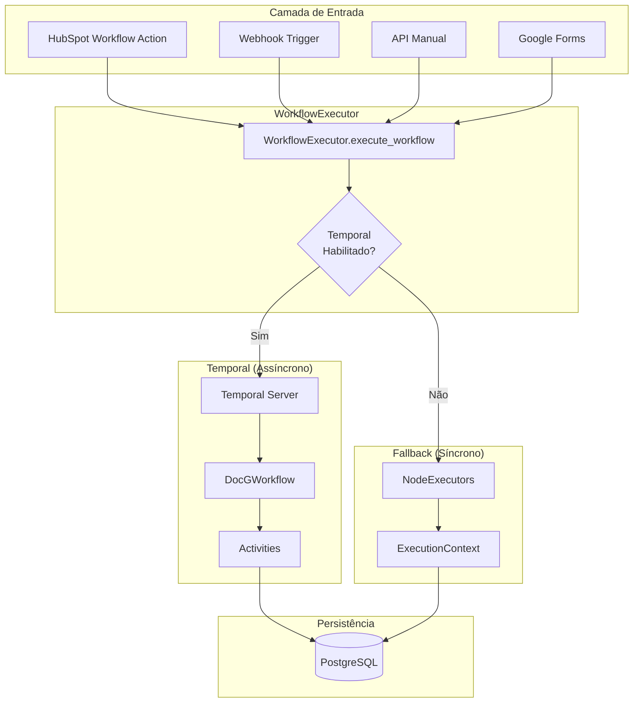
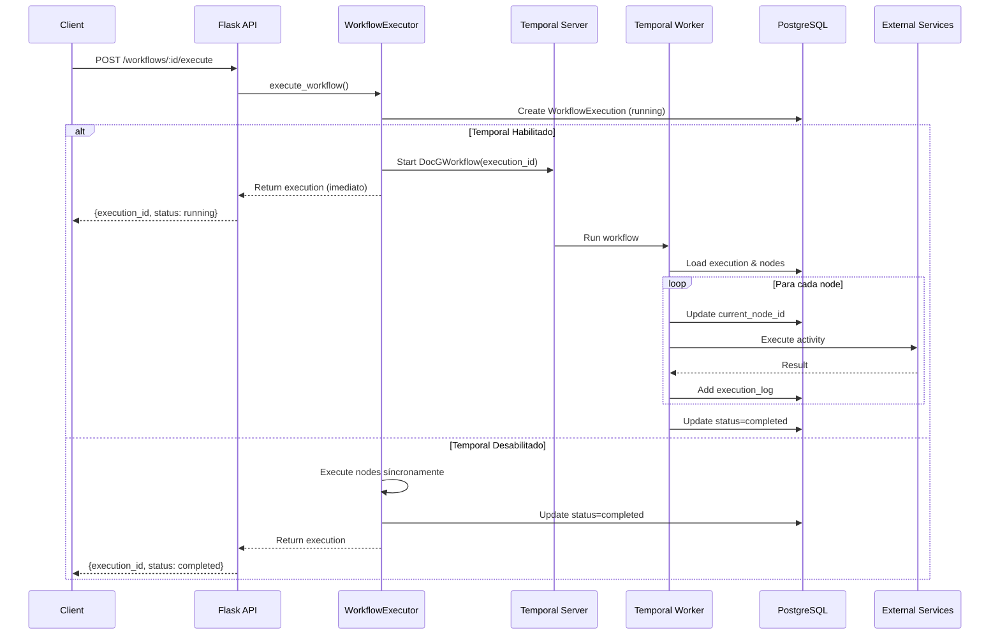
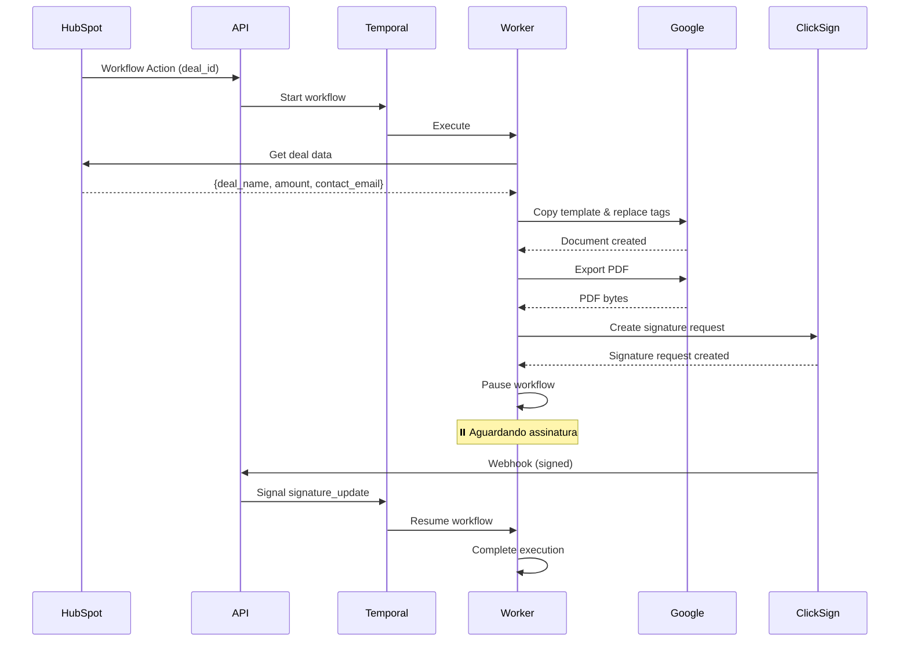
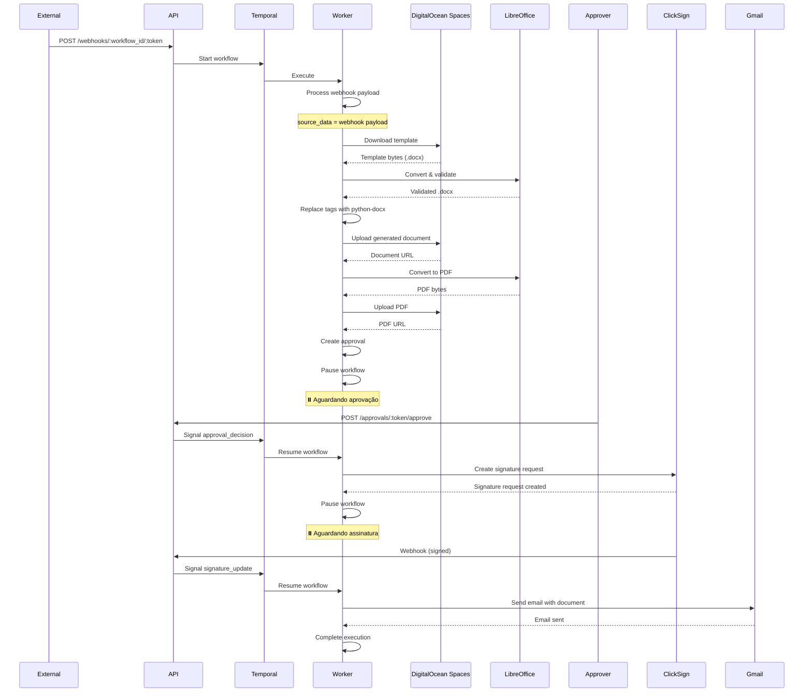
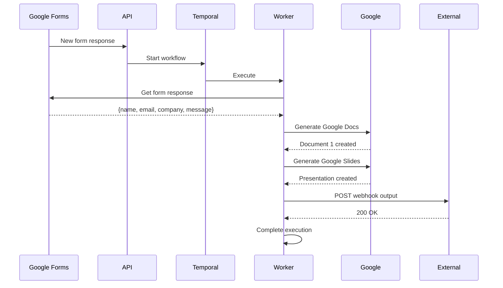
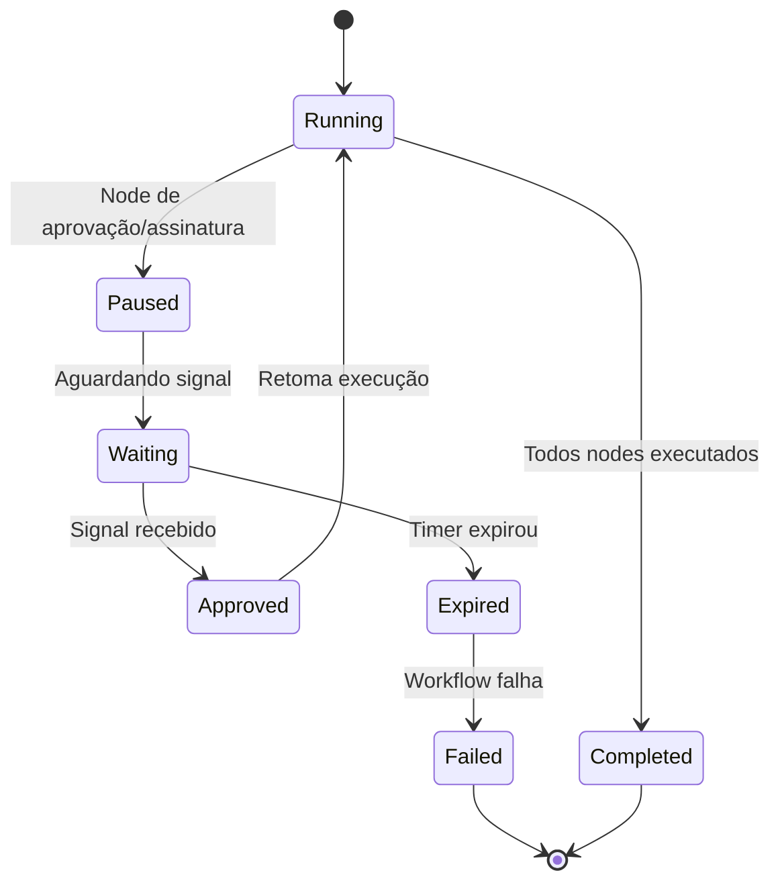

# Arquitetura de Execução de Workflows - DocG

> **Atualizado em:** Dezembro 2025  
> **Versão:** 4.0 — Arquitetura Completa de Execução

## 📋 Índice

1. [Visão Geral](#visão-geral)
2. [Arquitetura de Execução](#arquitetura-de-execução)
3. [Componentes Principais](#componentes-principais)
4. [Fluxo de Execução](#fluxo-de-execução)
5. [Tipos de Nodes](#tipos-de-nodes)
6. [Cenários de Execução](#cenários-de-execução)
7. [Pausas e Retomadas](#pausas-e-retomadas)
8. [Rastreamento e Logs](#rastreamento-e-logs)
9. [Fallback e Resiliência](#fallback-e-resiliência)

---

## Visão Geral

O sistema DocG executa workflows de forma **assíncrona e durável**, permitindo processar documentos, aguardar aprovações humanas, coletar assinaturas e enviar notificações de forma confiável.

### Características Principais

- ✅ **Execução Assíncrona**: Workflows não bloqueiam requisições HTTP
- ✅ **Durabilidade**: Execuções persistem mesmo se o servidor reiniciar
- ✅ **Pausas Inteligentes**: Aguarda aprovações e assinaturas sem polling
- ✅ **Rastreamento Completo**: Logs detalhados de cada etapa
- ✅ **Fallback Automático**: Execução síncrona se Temporal não disponível

### Stack Tecnológico

- **Temporal.io**: Orquestração durável de workflows
- **Flask**: API REST para iniciar execuções
- **PostgreSQL**: Persistência de execuções e logs
- **Activities**: Unidades de trabalho executadas pelo Temporal

---

## Arquitetura de Execução

### Diagrama de Alto Nível



### Fluxo de Decisão

1. **Requisição chega** → `WorkflowExecutor.execute_workflow()`
2. **Cria `WorkflowExecution`** no banco (status: `running`)
3. **Verifica Temporal**:
   - ✅ **Habilitado**: Inicia workflow via Temporal e retorna imediatamente
   - ❌ **Desabilitado**: Executa síncronamente (fallback)

---

## Componentes Principais

### 1. WorkflowExecutor

**Arquivo:** `app/services/workflow_executor.py`

Responsável por iniciar execuções de workflows.

**Método Principal:**
```python
def execute_workflow(
    workflow: Workflow,
    source_object_id: str,
    source_object_type: str,
    user_id: Optional[str] = None
) -> WorkflowExecution
```

**Comportamento:**
- Cria `WorkflowExecution` no banco
- Verifica se Temporal está habilitado
- Se sim: Chama `start_workflow_execution()` e retorna
- Se não: Executa síncronamente usando `NodeExecutors`

### 2. DocGWorkflow (Temporal)

**Arquivo:** `app/temporal/workflows/docg_workflow.py`

Workflow principal que orquestra a execução de nodes.

**Fluxo:**
1. Carrega execution e nodes do banco
2. Processa nodes sequencialmente
3. Pausa quando necessário (aprovação/assinatura)
4. Aguarda signals para retomar
5. Finaliza e atualiza status

### 3. Activities (Temporal)

**Arquivo:** `app/temporal/activities/`

Unidades de trabalho executadas pelo Temporal:

- **`execute_trigger_node`**: Extrai dados (HubSpot, Webhook, Google Forms)
- **`execute_document_node`**: Gera documentos (Google Docs, Word, Uploaded)
- **`execute_webhook_node`**: Envia POST para endpoint externo
- **`create_approval`**: Cria solicitação de aprovação
- **`create_signature_request`**: Cria solicitação de assinatura
- **`execute_email_node`**: Envia emails
- **`update_current_node`**: Atualiza node atual
- **`add_execution_log`**: Adiciona log de execução

### 4. ExecutionContext

**Arquivo:** `app/services/workflow_executor.py`

Contexto compartilhado entre nodes durante execução.

**Campos:**
- `workflow_id`, `execution_id`
- `source_object_id`, `source_object_type`
- `source_data`: Dados extraídos do trigger
- `generated_documents`: Lista de documentos gerados
- `signature_requests`: Lista de solicitações de assinatura
- `metadata`: Metadados (erros, timestamps, etc.)

---

## Fluxo de Execução

### Sequência Completa



### Etapas Detalhadas

1. **Início da Execução**
   - Cliente chama API: `POST /api/v1/workflows/:id/execute`
   - `WorkflowExecutor` cria `WorkflowExecution` no banco
   - Se Temporal habilitado: inicia workflow e retorna imediatamente
   - Se não: executa síncronamente

2. **Processamento de Nodes**
   - Workflow carrega nodes ordenados por `position`
   - Para cada node:
     - Atualiza `current_node_id` no banco
     - Executa activity correspondente
     - Adiciona log de execução
     - Atualiza `execution_context` com resultados

3. **Pausas (se necessário)**
   - Node de aprovação: cria `WorkflowApproval` e pausa
   - Node de assinatura: cria `SignatureRequest` e pausa
   - Workflow aguarda signal ou timeout

4. **Retomada**
   - Webhook/API envia signal para Temporal
   - Workflow recebe signal e continua execução
   - Processa nodes restantes

5. **Finalização**
   - Atualiza status para `completed` ou `failed`
   - Salva `execution_time_ms`
   - Frontend pode consultar resultado

---

## Tipos de Nodes

### Tabela de Comportamento

| Node Type | Activity | Pausa? | Espera Signal? | Timer? | Descrição |
|-----------|----------|--------|----------------|--------|-----------|
| `hubspot` | `execute_trigger_node` | ❌ | ❌ | ❌ | Extrai dados do HubSpot |
| `webhook` (trigger) | `execute_trigger_node` | ❌ | ❌ | ❌ | Recebe dados via webhook |
| `google-forms` | `execute_trigger_node` | ❌ | ❌ | ❌ | Extrai respostas do Google Forms |
| `google-docs` | `execute_document_node` | ❌ | ❌ | ❌ | Gera documento Google Docs |
| `google-slides` | `execute_document_node` | ❌ | ❌ | ❌ | Gera apresentação Google Slides |
| `microsoft-word` | `execute_document_node` | ❌ | ❌ | ❌ | Gera documento Word |
| `microsoft-powerpoint` | `execute_document_node` | ❌ | ❌ | ❌ | Gera apresentação PowerPoint |
| `uploaded-document` | `execute_document_node` | ❌ | ❌ | ❌ | Gera documento a partir de template enviado |
| `webhook` (output) | `execute_webhook_node` | ❌ | ❌ | ❌ | Envia POST para endpoint externo |
| `gmail` | `execute_email_node` | ❌ | ❌ | ❌ | Envia email via Gmail |
| `outlook` | `execute_email_node` | ❌ | ❌ | ❌ | Envia email via Outlook |
| `review-documents` | `create_approval` | ✅ | `approval_decision` | `expires_at` | Aguarda aprovação humana |
| `request-signatures` | `create_signature_request` | ✅ | `signature_update` | `expires_at` | Aguarda assinaturas |

### Node: Trigger

**Tipos:** `hubspot`, `webhook`, `google-forms`

**Função:** Extrai dados da fonte de dados.

**Fluxo:**
1. Activity `execute_trigger_node` é chamada
2. Baseado no tipo, usa `DataSource` apropriado:
   - `HubSpotDataSource`: Busca objeto no HubSpot
   - `GoogleFormsDataSource`: Busca respostas do formulário
   - Webhook: Usa dados já recebidos
3. Retorna `source_data` que será usado nos nodes seguintes

**Exemplo:**
```python
# HubSpot trigger
source_data = {
    "deal_name": "Acme Corp Deal",
    "amount": 50000,
    "contact_email": "john@acme.com"
}
```

### Node: Document

**Tipos:** `google-docs`, `google-slides`, `microsoft-word`, `microsoft-powerpoint`, `uploaded-document`

**Função:** Gera documento a partir de template.

**Fluxo:**
1. Activity `execute_document_node` é chamada
2. Busca template no banco
3. Copia template (Google/Microsoft) ou baixa do DigitalOcean Spaces (uploaded)
4. Substitui tags usando `TagProcessor`
5. Processa tags AI (se configurado)
6. Gera PDF (se solicitado)
7. Salva `GeneratedDocument` no banco
8. Retorna `document_id` e URLs

**Templates Enviados:**
- Baixa template do DigitalOcean Spaces
- Normaliza .doc para .docx (se necessário)
- Valida estrutura do documento
- Processa com `python-docx`
- Salva documento gerado em `docg/{org_id}/outputs/`
- Gera PDF usando LibreOffice (se configurado)

### Node: Webhook (Output)

**Tipo:** `webhook`

**Função:** Envia POST para endpoint externo com resultado da execução.

**Fluxo:**
1. Activity `execute_webhook_node` é chamada
2. Prepara body com `execution_context`
3. Processa template de body (se configurado) usando `TagProcessor`
4. Envia POST com headers customizados
5. Retry automático em caso de falha

### Node: Approval

**Tipo:** `review-documents`, `human-in-loop`

**Função:** Pausa workflow e aguarda aprovação humana.

**Fluxo:**
1. Activity `create_approval` cria `WorkflowApproval`
2. Workflow pausa (`status = 'paused'`)
3. Workflow aguarda signal `approval_decision` ou timeout
4. Se aprovado: retoma execução
5. Se rejeitado ou expirado: falha workflow

**Signal:**
```python
# Enviado via POST /api/v1/approvals/:token/decision
{
    "decision": "approved" | "rejected",
    "comment": "opcional"
}
```

### Node: Signature

**Tipo:** `request-signatures`, `signature`, `clicksign`

**Função:** Pausa workflow e aguarda assinaturas.

**Fluxo:**
1. Activity `create_signature_request` cria `SignatureRequest`
2. Envia documento para provedor de assinatura (ClickSign, etc.)
3. Workflow pausa (`status = 'paused'`)
4. Workflow aguarda signal `signature_update` ou timeout
5. Quando todos assinarem: retoma execução
6. Se rejeitado ou expirado: falha workflow

**Signal:**
```python
# Enviado via POST /api/v1/webhooks/signature/:provider
{
    "signature_request_id": "uuid",
    "status": "signed" | "declined",
    "signer_email": "email@ex.com"
}
```

### Node: Email

**Tipos:** `gmail`, `outlook`

**Função:** Envia email com documento gerado.

**Fluxo:**
1. Activity `execute_email_node` é chamada
2. Prepara email com template
3. Anexa documento gerado (se configurado)
4. Envia via API do provedor
5. Registra envio

---

## Cenários de Execução

### Cenário 1: Workflow Simples

**Fluxo:** HubSpot → Google Docs → PDF → Assinatura



**Nodes:**
1. **Trigger (hubspot)**: Extrai dados do deal
2. **Document (google-docs)**: Gera documento com tags substituídas
3. **Signature (clicksign)**: Envia para assinatura e pausa
4. **Retomada**: Após assinatura, workflow completa

### Cenário 2: Workflow Complexo

**Fluxo:** Webhook → Uploaded Document → PDF → Aprovação → Assinatura → Email



**Nodes:**
1. **Trigger (webhook)**: Recebe payload externo
2. **Document (uploaded-document)**: 
   - Baixa template do Spaces
   - Normaliza e valida
   - Substitui tags
   - Gera PDF
   - Salva no Spaces
3. **Approval (review-documents)**: Pausa e aguarda aprovação
4. **Signature (request-signatures)**: Pausa e aguarda assinatura
5. **Email (gmail)**: Envia notificação

### Cenário 3: Google Forms → Múltiplos Documentos

**Fluxo:** Google Forms → Google Docs + Google Slides → Webhook Output



**Nodes:**
1. **Trigger (google-forms)**: Extrai resposta do formulário
2. **Document (google-docs)**: Gera documento
3. **Document (google-slides)**: Gera apresentação
4. **Webhook (output)**: Envia resultado para sistema externo

---

## Pausas e Retomadas

### Como Funciona

Workflows podem pausar em dois pontos:

1. **Aprovação Humana** (`review-documents`)
2. **Assinatura Digital** (`request-signatures`)

### Mecanismo de Pausa



### Signals

**Approval Signal:**
- **Endpoint**: `POST /api/v1/approvals/:token/decision`
- **Payload**: `{decision: "approved"|"rejected", comment: "opcional"}`
- **Ação**: Envia signal `approval_decision` para Temporal

**Signature Signal:**
- **Endpoint**: `POST /api/v1/webhooks/signature/:provider`
- **Payload**: Webhook do provedor de assinatura
- **Ação**: Se todos assinaram, envia signal `signature_update` para Temporal

### Timeouts

- **Aprovação**: Configurável por node (default: 48 horas)
- **Assinatura**: Configurável por node (default: 7 dias)
- **Expiração**: Workflow falha automaticamente se timeout

---

## Rastreamento e Logs

### WorkflowExecution

**Campos Principais:**
- `id`: UUID da execução
- `workflow_id`: Workflow executado
- `status`: `running`, `paused`, `completed`, `failed`
- `current_node_id`: Node atual sendo executado
- `execution_logs`: Array de logs por node
- `execution_context`: Snapshot do contexto
- `temporal_workflow_id`: ID do workflow no Temporal
- `temporal_run_id`: Run ID do Temporal

### Execution Logs

**Estrutura:**
```json
[
  {
    "node_id": "uuid",
    "node_type": "google-docs",
    "status": "success" | "failed",
    "started_at": "2025-12-01T10:00:00Z",
    "completed_at": "2025-12-01T10:00:05Z",
    "duration_ms": 5000,
    "output": {
      "document_id": "uuid",
      "file_url": "https://..."
    },
    "error": null
  }
]
```

### Endpoints de Consulta

**GET** `/api/v1/workflows/:id/runs/:run_id`
- Retorna detalhes da execução
- Inclui `current_node_id`, `execution_logs`, `steps_completed`

**GET** `/api/v1/workflows/:id/runs`
- Lista todas as execuções
- Calcula progresso baseado em `current_node_id` ou logs

### Cálculo de Progresso

```python
# Baseado em current_node_id (preferencial)
current_node = find_node_by_id(current_node_id)
steps_completed = count_nodes_before(current_node, exclude_trigger=True)

# Fallback: baseado em execution_logs
steps_completed = count_logs_with_status(['success', 'failed'])
```

---

## Fallback e Resiliência

### Modo Síncrono (Fallback)

Se Temporal não estiver disponível, o sistema executa de forma síncrona:

1. `WorkflowExecutor` detecta que Temporal não está habilitado
2. Executa nodes sequencialmente usando `NodeExecutors`
3. Retorna resultado imediatamente
4. **Limitação**: Não suporta pausas longas (timeout HTTP)

### Retry Automático

**Temporal Activities:**
- Retry automático com backoff exponencial
- Configurável por tipo de activity
- Máximo de tentativas configurável

**Exemplo:**
```python
RetryPolicy(
    initial_interval=timedelta(seconds=1),
    backoff_coefficient=2.0,
    maximum_attempts=3
)
```

### Tratamento de Erros

**Erros Críticos** (interrompem execução):
- Falha no trigger node
- Falha no primeiro document node
- Rejeição de aprovação
- Expiração de aprovação/assinatura

**Erros Não-Críticos** (continuam execução):
- Falha em email node
- Falha em webhook output (após retries)

---

## Estrutura de Arquivos

```
app/
├── services/
│   └── workflow_executor.py      # WorkflowExecutor (inicia execuções)
├── temporal/
│   ├── service.py                # Funções síncronas para Flask
│   ├── client.py                 # Cliente Temporal
│   ├── worker.py                 # Worker que executa workflows
│   ├── workflows/
│   │   └── docg_workflow.py      # DocGWorkflow (orquestração)
│   └── activities/
│       ├── base.py               # load, update, pause, resume, complete
│       ├── trigger.py            # execute_trigger_node
│       ├── document.py           # execute_document_node
│       ├── approval.py           # create_approval, expire_approval
│       ├── signature.py          # create_signature_request, expire_signature
│       ├── email.py              # execute_email_node
│       └── webhook.py            # execute_webhook_node
└── routes/
    ├── workflows.py              # Endpoints de execução
    ├── webhooks.py               # Webhooks (envia signals)
    └── approvals.py              # Aprovações (envia signals)
```

---

## Referências

### Código Fonte

- `app/services/workflow_executor.py` - Inicia execuções
- `app/temporal/workflows/docg_workflow.py` - Orquestração
- `app/temporal/activities/` - Implementação de nodes
- `app/routes/workflows.py` - Endpoints de API
- `app/routes/webhooks.py` - Webhooks e signals
- `app/models/execution.py` - Model de execução

### Documentação Externa

- [Temporal Python SDK](https://docs.temporal.io/dev-guide/python)
- [Temporal Concepts](https://docs.temporal.io/concepts)

---

**Última Atualização:** Dezembro 2025  
**Status:** ✅ Arquitetura Completa e Funcional
